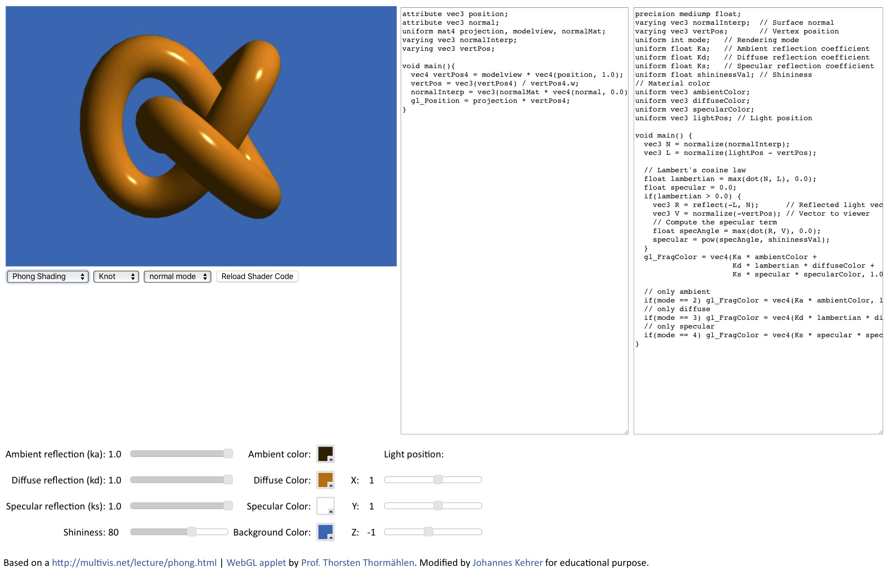

A small WebGL demo of 
[Phong Illumination](https://en.wikipedia.org/wiki/Phong_reflection_model)
using
[Gouraud](https://en.wikipedia.org/wiki/Gouraud_shading) 
or 
[Phong Shading](https://en.wikipedia.org/wiki/Phong_shading).

To run locally with python use:

    ./phong.sh

This is a barely changed version of the code at:

http://multivis.net/lecture/phong.html
